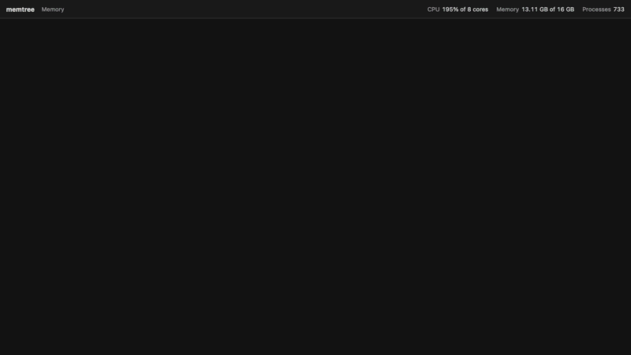

# memtree



See what is holding your Mac's memory, live, as a treemap that moves.

memtree draws every running process as a tile sized by what it really
costs, grouped under the app it belongs to, and samples the machine once a
second. Between samples nothing jumps: sizes ease from one reading to the
next and tiles glide to their new places, so you can watch a browser tab
swell, a build fan out into workers, or a leak creep up on everything else.

A companion to [tobi/disktree](https://github.com/tobi/disktree), which does
the same for what fills your disk, and whose packaging this copies shamelessly.
Swift and SwiftUI, nothing else.

## Install

Download `memtree-*-aarch64-macos.zip` (`x86_64-macos` for an Intel Mac) from
the [latest release](https://github.com/Grant-Postma/memtree/releases/latest),
unzip it, and drag `memtree.app` into Applications. macOS 14 or newer.

The release is signed ad hoc, not notarized, so Gatekeeper says it "is
damaged and can't be opened". The app is fine; the browser marked the
download as quarantined. Clear the mark once:

```
xattr -dr com.apple.quarantine /Applications/memtree.app
```

(Or open it once, then choose **Open Anyway** in System Settings › Privacy &
Security.)

Or build it. The Command Line Tools are enough, no Xcode needed:

```
git clone https://github.com/Grant-Postma/memtree
cd memtree
make install     # ~/Applications/memtree.app, and ~/.local/bin/memtree
make uninstall
```

## Use

```
memtree                                  # open the window
memtree --record out.mp4 --gif out.gif   # record this machine, see below
memtree --help
```

- **Tiles** are processes. **Groups** are apps: every helper of Chrome,
  Slack or Claude lands under the app whose bundle it runs from, so the
  first thing you see is which apps cost what. Tools outside an app
  (`node`, `python3`, `claude`) group by name; everything from the system
  folders is **macOS**.
- **+N more** is the processes in a group too small to read, as one tile.
- **Point** at a tile for its pid, CPU and memory. **Click** an app to fill
  the window with it; `esc` comes back.

| key | does |
| --- | --- |
| `m` | size by memory (the default) |
| `c` | size by CPU; busy processes glow |
| `i` | in CPU mode, show idle capacity as a tile |
| `space` | pause |
| `esc` | back out of an app |

## Recording

`memtree --record out.mp4` samples the machine in real time, then renders
every frame offscreen through the same painter as the window, and writes an
H.264 MP4 with AVFoundation (and a GIF with ImageIO, and a PNG of the last
frame). No screen recording permission, no dropped frames, nothing to install.

```
memtree --record out.mp4 [--gif out.gif] [--png out.png]
        [--seconds 12] [--fps 30] [--gif-fps 10] [--cpu]
        [--size 1280x720] [--scale 1.5]
```

The clip above is `make record`: seventeen seconds of this machine, with
`scripts/demo-ramp.py` allocating 2 GB in steps and giving it back, which is
the Python tile that shoulders everything aside and then deflates. The rest is
just what was running.

## What it measures

- **Memory** is the physical footprint, `ri_phys_footprint` from
  `proc_pid_rusage`: what Activity Monitor's Memory column shows. It
  counts compressed pages and leaves out shared ones.
- **CPU** is the change in a process's user and system time over the last
  interval, so 100% is one core.
- **Other users' processes** (root daemons, mostly) are closed to
  `proc_pid_rusage`. For those memtree asks `/bin/ps`, which is setuid root
  on macOS, and uses its resident size and CPU time instead. The details line
  says "resident, via ps" when that is what you are looking at.
- **Used memory** in the top bar is app, wired and compressed pages, the way
  Activity Monitor adds it up.

No root, no helper, no entitlements.

## How it stays smooth

A treemap that is recomputed every second jumps every second. Squarified
layouts are the worst for it: nudge one large tile and every row break after
it can move, and hundreds of small tiles land somewhere new. memtree does four
things about that:

- **Values ease.** A new sample is not shown; the displayed size moves from
  the old reading to the new one over the next second, smoothstepped, and
  the layout is recomputed from that every frame.
- **Row breaks are sticky.** The layout is split into the discrete choice
  (which tiles share a row, and which way it runs) and the continuous one
  (where they go). The old rows are kept while their tiles stay reasonably
  square, so sizes change continuously and tiles only rearrange when the old
  arrangement has clearly gone bad.
- **Order is sticky.** A tile passes the one ahead of it only once it is 15%
  larger, so near-equal processes do not trade places every sample.
- **Tiles ease, relative to their group.** Every rect eases toward its
  target, and a process's rect lives in its group's coordinates, so a group
  that moves carries its processes with it instead of trailing them across
  the screen.

Tiny processes fold into **+N more**, with hysteresis so none blinks at the
threshold. Labels are rendered once into bitmaps with CoreText, since Canvas
would otherwise rasterize every glyph on every frame.

It still costs something: about a third of one core while animating at
60 fps on an M-series Mac. `space` pauses it.

## Develop

```
make run      # release build, open the window
make test     # layout, ordering and grouping tests (Swift Testing)
make record   # regenerate assets/memtree.mp4, .gif and screenshot.png
make zip      # the release zip and its .sha256
```

| path | what lives there |
| --- | --- |
| `Sources/memtree/Sampler.swift` | the process table: rusage, `ps`, grouping by app |
| `Sources/memtree/Treemap.swift` | squarified layout, split into partition and placement, and the sticky layout |
| `Sources/memtree/LiveModel.swift` | sampling, easing, ordering, folding: one frame's tiles |
| `Sources/memtree/Painter.swift` | drawing a frame, shared by the window and the recorder |
| `Sources/memtree/Recorder.swift` | `--record`: offscreen frames to MP4 and GIF |
| `.github/workflows/release.yml` | push a `v*` tag: native builds on Apple Silicon and Intel, zips with checksums, a draft published once both are in |

## License

MIT
